# 099：隐形且鲁棒的扩散图像指纹（技术解析）🔍

在本节课中，我们将学习一篇关于为扩散模型生成的图像添加水印的论文。这种水印技术是隐形的，并且对后处理攻击具有极强的鲁棒性。我们将从回顾扩散模型的基本原理开始，然后深入探讨这种水印技术是如何工作的。

## 概述与背景

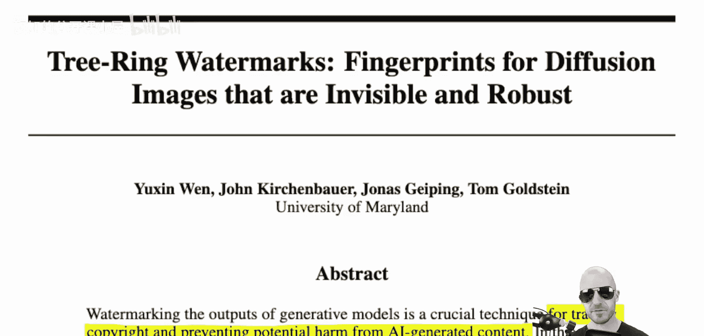

这篇论文由马里兰大学的Yushin Wen、John Keerkenbaauer、Jon Skyping和Tom Goldstein共同完成。它提出了一种针对生成模型（特别是扩散模型）图像的水印技术。

与通常对扩散模型输出图像进行后处理修改的其他水印技术不同，本文的方法从生成过程的最初阶段就介入。它直接作用于扩散模型的潜在空间或噪声空间，在那里嵌入水印，然后让扩散过程继续运行。因此，这种信号既无法被人眼察觉，也对后处理攻击或扰动具有更强的鲁棒性。

作者指出，随着扩散模型生成图像的能力日益强大，产生了追踪图像是否由特定模型生成的需求。这涉及到版权保护、防止AI生成内容造成潜在危害，或者仅仅是想确认某张图片是否由这些模型生成。

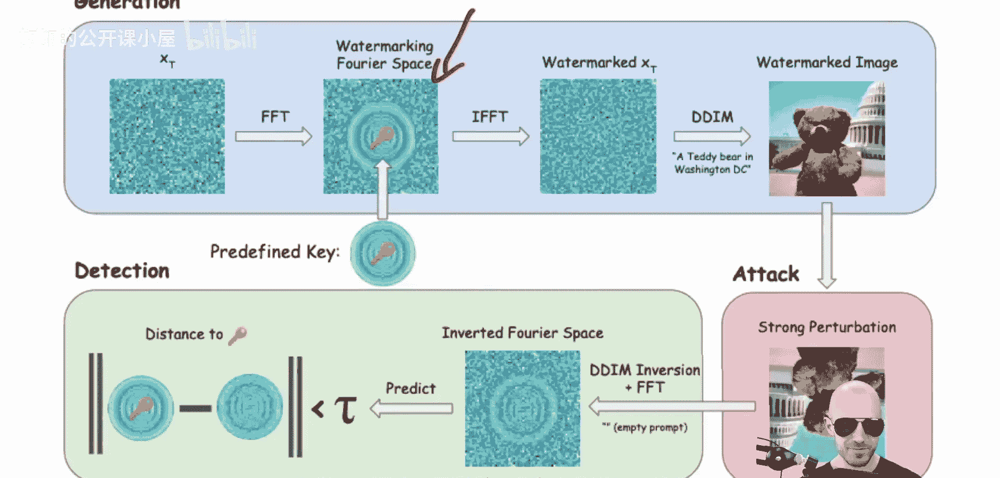

## 技术设置与前提

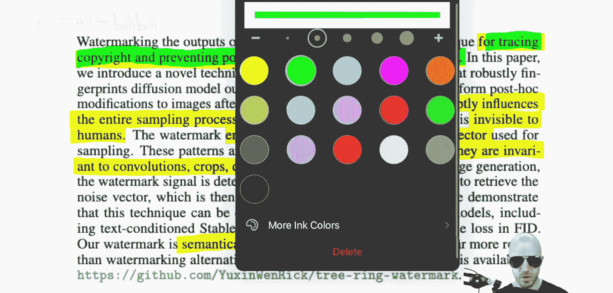

该技术的设置如下：模型被置于一个API之后。用户通过某种API或Web接口调用模型并获得生成的图像。

以下是该技术的工作前提：模型的权重需要被隐藏，并且仅对进行水印操作的人员可用。否则，任何人都可以直接使用模型生成无水印的图像，从而使水印技术失效。因此，我们的讨论基于模型通过API提供服务的场景。

当用户通过API调用模型并获得图像时，如果水印过程在模型端正确执行，那么对于这张图像，我们总是可以证明它确实是由这个模型创建的。我们将在图像中植入某种隐藏信号，终端用户既无法察觉（隐形），也难以轻易去除。

接下来，我们将回顾扩散模型的工作原理，这对于理解水印技术至关重要。

## 扩散模型回顾 🎨

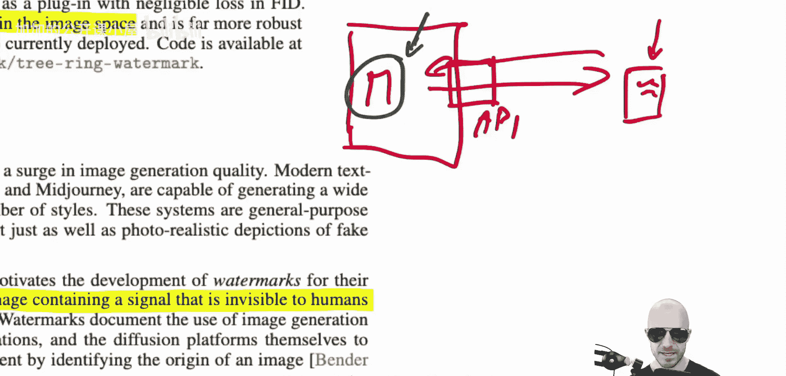

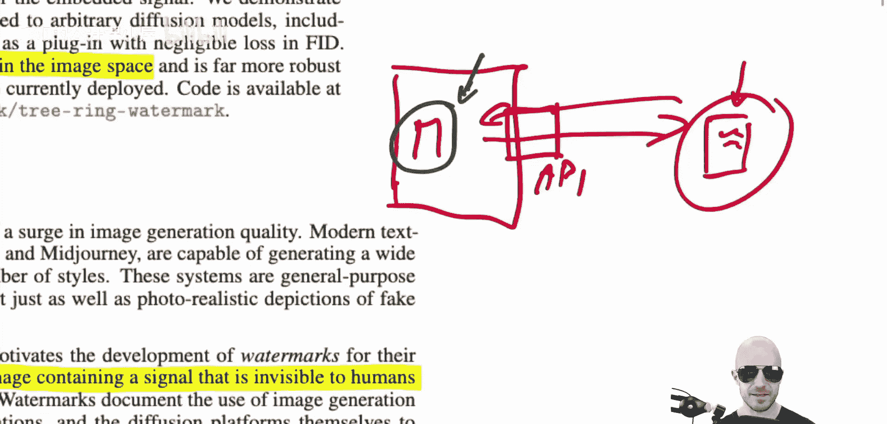

扩散模型通过逐步从随机噪声中生成图像。训练一个模型，使其能够一步步地从随机噪声中还原出图像。

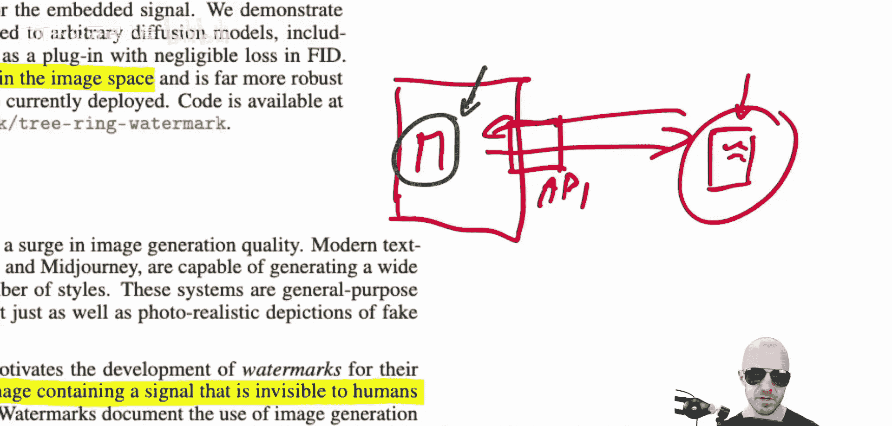

具体过程是：从一个与目标图像尺寸相同的纯随机噪声图像开始。这个噪声图像中的每个像素都采样自高斯分布。然后，模型逐步地、一步步地去除少量噪声。经过许多步之后，一个清晰的图像逐渐形成，就像我们之前看到的泰迪熊图片一样。

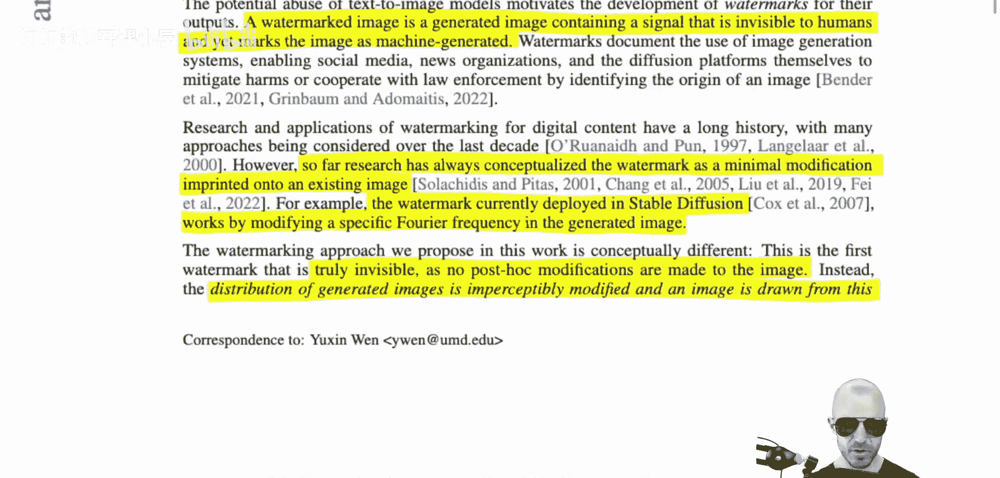

这听起来可能有些神奇。我们有一个模型，它接收一个最初只是纯随机噪声的图像，然后通过反复应用该模型，将噪声转化为图像。

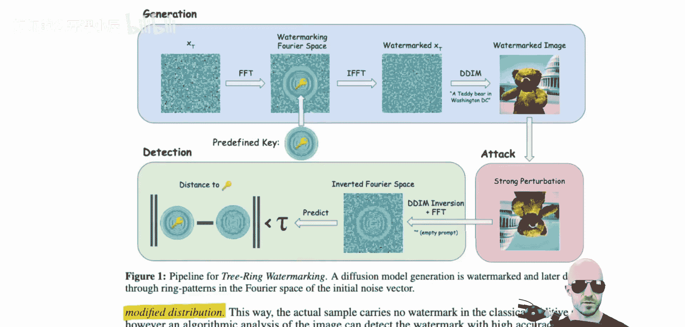

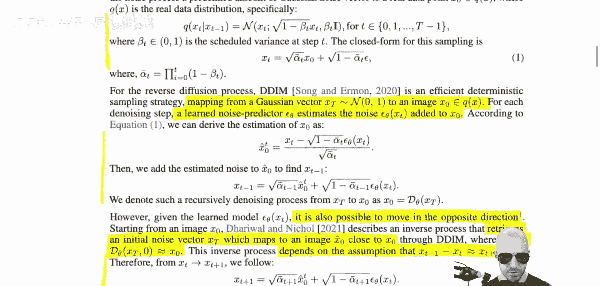

那么，为什么这能行得通呢？关键在于训练方式。我们通过以下方式训练这个模型：

1.  从数据集中取一张真实图像（例如一张房子的图片）。
2.  向这张图像添加少量噪声（记为 ε），得到一张带有轻微噪声的图像。
3.  训练一个神经网络模型，输入这张带噪声的图像，并让它输出添加噪声之前的原始图像。这是深度学习可以完成的任务。

我们不仅可以训练单步去噪，还可以训练多步。我们可以对已添加一次噪声的图像再次添加噪声，得到噪声更多的图像，然后训练神经网络去恢复那个只被添加过一次噪声的“原始”图像。

我们可以通过从真实数据开始，反复添加噪声来为这个过程创建自己的训练数据。这里有一个关键的数学事实：如果我们反复多次地向一个真实数据点添加噪声（实践中需要进行一些缩放处理），那么在极限情况下，最终得到的结果将完全是遵循高斯分布的纯随机高斯噪声。

这意味着，我们在反向过程中训练的终点（纯随机噪声），正是我们可以从采样器中实际产生的东西，也就是正向过程的起点。因为我们训练了一个神经网络来单独处理每一步的去噪，我们可以利用它来逐步生成图像。我们可以说：这是纯随机噪声，那么在这个噪声过程中，它的前一步是什么？神经网络会告诉我们。再前一步是什么？它也会告诉我们。我们只需反复应用这个训练好的、用于逆转单步噪声过程的网络，直到得到一张图像。

因此，这里的纯随机噪声就像是一个随机种子。最终生成的图像，就是从这个随机种子开始，反复应用我们训练的反向网络所得到的确定性函数的结果。

## 树环水印的核心思想 💡

现在，我们进入水印技术的核心。正是在上面提到的这个“随机种子”中，我们将嵌入某种密钥。你已经可以预见到这会产生什么效果：改变随机种子，实际上会改变最终生成的图像，而且是以一种相当巧妙的方式。

因此，这种水印的效果将完全不同于那些仅对最终结果进行处理的其他水印技术。接下来，我们形式化地描述这个过程。

扩散过程的正向过程（加噪）可以定义为：从一张噪声较少的图像 `X_{t-1}`（`X_0` 是原始图像），得到一张噪声更多的图像 `X_t`。公式如下：

`X_t = sqrt(1 - β_t) * X_{t-1} + sqrt(β_t) * ε`

其中，`ε` 采样自标准高斯分布 `N(0, I)`，`β_t` 是一个预定义的方差调度参数。由于这个过程的性质，经过足够多步的加噪后，`X_T` 会趋近于纯高斯噪声。

反向过程（去噪）则训练一个神经网络 `ε_θ` 来预测每一步所添加的噪声。采样（生成图像）时，我们从随机噪声 `X_T ~ N(0, I)` 开始，然后迭代应用以下公式：

`X_{t-1} = (1 / sqrt(α_t)) * (X_t - (β_t / sqrt(1 - \bar{α}_t)) * ε_θ(X_t, t)) + σ_t * z`

其中 `z ~ N(0, I)`，`α_t = 1 - β_t`，`\bar{α}_t` 是 `α_t` 的累积乘积，`σ_t` 是噪声方差。

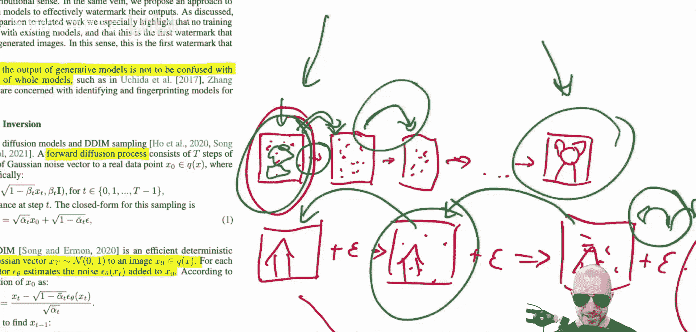

树环水印的关键在于，它不修改最终图像，而是修改生成过程的起点——那个随机噪声种子 `X_T`。水印信息被编码到这个初始噪声向量中。由于扩散模型对初始条件高度敏感，嵌入水印后的种子会引导模型生成一个与原始种子不同、但视觉上仍然自然合理的图像。而检测水印时，则需要使用密钥和特定的解码算法，从可能经过修改的生成图像中尝试恢复出嵌入的信号。

这种在源头嵌入水印的方式，使得水印成为图像生成过程内在的一部分，而非外在的附加物，从而获得了极强的鲁棒性。

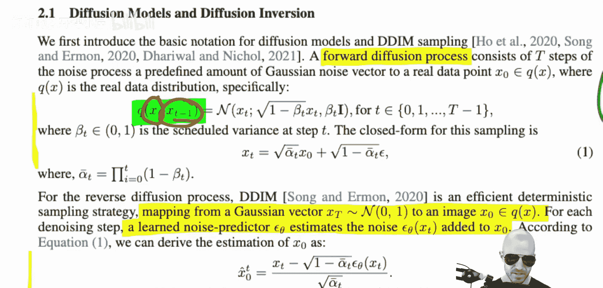

## 总结

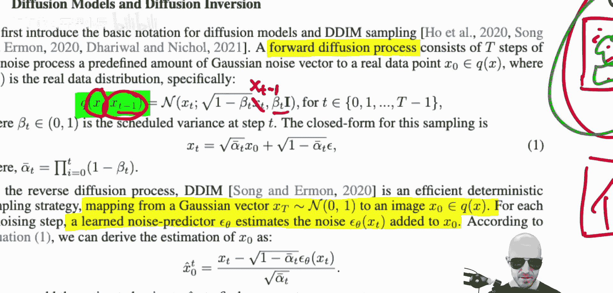

本节课我们一起学习了一种名为“树环水印”的先进技术。它通过修改扩散模型生成过程的初始噪声种子来嵌入隐形水印，而非对输出图像进行后处理。这种方法使水印对图像的各种修改和攻击具有出色的鲁棒性，因为水印信号深度融入了图像的生成轨迹中。我们回顾了扩散模型加噪和去噪的基本原理，并理解了水印嵌入的切入点。这种从源头保障版权和可追溯性的思想，为管理AI生成内容提供了强有力的技术工具。